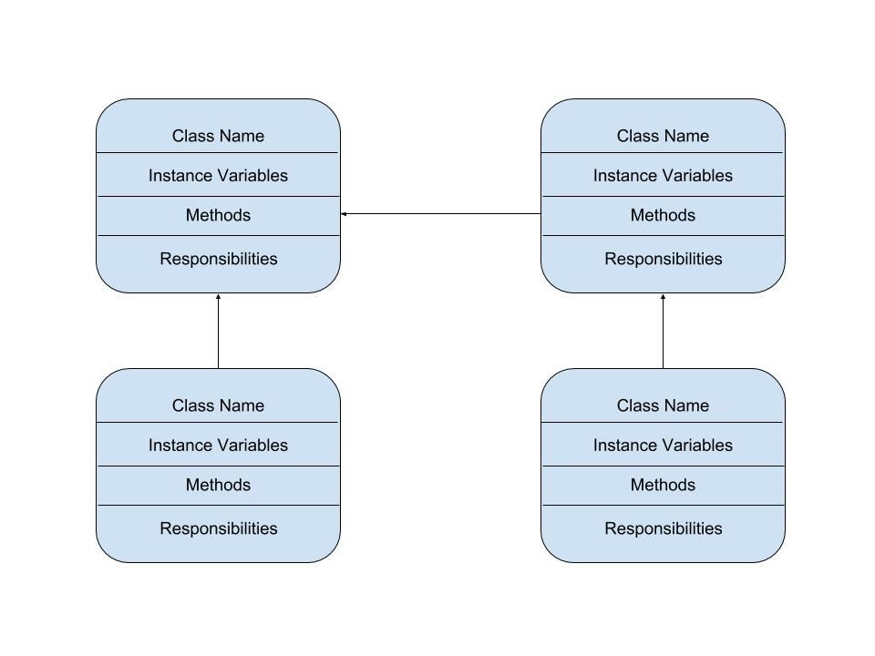

:warning: Everything between << >> needs to be replaced (remove << >> after replacing)

# << Jumpy Eagle >>
## CS 110 Final Project
### << Fall, 2019 >>
### [Assignment Description](https://drive.google.com/open?id=1HLIk-539N9KiAAG1224NWpFyEl4RsPVBwtBZ9KbjicE)

<< [https://github.com/<repo>](#) >>

<< [link to demo presentation slides](#) >>
https://drive.google.com/file/d/1Mi5WBT0nb6CsAjuOjqw_oe2v_rBrfV3n/view?usp=sharing
https://drive.google.com/file/d/1ehW_HCByC-imvO7tDufV2tkcAnqnOKLi/view?usp=sharing

### Team: << Snowberry >>
#### << Oluwadamilare Alamutu, Justin Cadette, Richard E >>

***

## Project Description
<< Our project will be a platformer game where the player must control and eagle to avoid pipes as the eagle soars throuh the sky. The player gets one life and unlimited time to dodge as many pipes as they can. >>

***    

## User Interface Design
* << A wireframe or drawing of the user interface concept along with a short description of the interface. You should have one for each screen in your program. >>
https://drive.google.com/file/d/1J0025TYK4HnqCwEec2WxJqSq2OcAyqw2/view?usp=sharing(Start Screen Draft)
https://drive.google.com/file/d/1obHemzodQqv1uYQi6ttyC5rBd_XGuRBp/view?usp=sharing(Help Screen Draft)
https://drive.google.com/file/d/1j_rzMpOEWRuMe8oj2F2spGBzXQSb6C_L/view?usp=sharing(Game Over Screen Draft)
    * For example, if your program has a start screen, game screen, and game over screen, you should include a wireframe / screenshot / drawing of each one and a short description of the components
* << You should also have a screenshot of each screen for your final GUI >>
https://drive.google.com/file/d/1k3QYdBO4uJZKD0PMwZtozUmpAk7Qh8fm/view?usp=sharing (Start Screen)
https://drive.google.com/file/d/1KEIM730jIebWTIJmh7_M9V4uXCRV2mYB/view?usp=sharing (Help Screen)
https://drive.google.com/file/d/1JIA9bA76JO3wYrPmtJH8yu08Janx0kb9/view?usp=sharing (Game Over Screen)

***        

## Program Design
* Non-Standard libraries
    * << You should have a list of any additional libraries or modules used (pygame, request) beyond non-standard python. >>
    * For each additional module you should include
    
    
         pygame - https://www.pygame.org/docs/
         Description: Pygame is a set of Python modules created to help design video games and graphics. It is designed to be used with the Python programming language.
        * url for the module documentation
        * a short description of the module
       
* Class Interface Design
    * << A simple drawing that shows the class relationships in your code (see below for an example). >>
        * 
    * This does not need to be overly detailed, but should show how your code fits into the Model/View/Controller paradigm.
* Classes
    * << You should have a list of each of your classes with a description. >>
   controller=brings togetehr all of the other clases and allows the game to function
   lowerPipe=creates the lower set of pipes that the eagle must avoid.
   main="click to run" creates a new instance of the game and runs it
   player=creats the eagle and governs its movement
   upperPipe=creates the upper set of pipe that the eagle must avoid.
***

## Tasks and Responsibilities
* You must outline the team member roles and who was responsible for each class/method, both individual and collaborative.

### Software Lead - << Oluwadamilare Alamutu >>
Asset collection
controller
player

<< Worked as integration specialist by finding ways to break down the program into multiple funstions and classes for the purpose of making the end goal easier to understand and the code easier to write. Having an idea of what the final code should look like structurally before even starting to write code allowed for more productive coding. In labs I found it easier to write an individual function than to cram the entire prgram into one class so I applied that concpet here.   >>

### Front End Specialist - << Richard E >>
Game research 
<< Front-end lead conducted significant research on the type of game we should make. >>

### Back End Specialist - << Justin Cadette >>
bug testing
upper pipe 
lower pipe 
main

<< The back end specialist played the game and searched for bugs. Finding bugs was critical in ensuring our game was playable. It was difficult to forecast how a player might play our game and where they might find issues so the only way to sort out bugs was to actually play the game. >>

## Testing
* << Describe your testing strategy for your project. >>
    * << To test different aspects of the code I used the "print" command. I printed variables in order to be able to trace them and see how they chnaged. Tracing variables allowed me to see if a class was functionla regardless if I had the other supporting classes functioning. I also commented out lines of code that I felt were not behaving as they should in order to see the affect of them being present and absent. Commneting out troublesome lines of code allowed me to pinpoint problematic lines and being able to address those as opposed to re-writing an entire class or function. >>

* Your ATP

| Step                  | Procedure     | Expected Results  | Actual Results |
| ----------------------|:-------------:| -----------------:| -------------- |
|  1  | Run Counter Program  | GUI window appears with count = 0  |   PASS       |
|  2  | Summon help screen by pressing the "H" key  | The help screen appears |    PASS             |
|  3  | Leave the help screen by pressing the "Esc" key | The start screen is shown|PASS|
|  4  | Start the game by clicking the "space" key | Game is started with eagle in mid-air|PASS|
|  5  | Press "space" key to make the bird fly higher | The birds y-cord increases and it moves higher|PASS|
|  6  | Press "space" to make eagle fly off screen | Eagle is unable to ascend once it reaches top of viewable area |PASS|
|  7  | Let eagle fall off screen by doing nothing | Eagle is kept on the screen even when no buttons are pressed|PASS|
|  8  | Press "enter" key to pause the game | The game is paused and the user is told how to un-pause |PASS|
|  9  |Crash into a pipe to summon game over screen| Game over screen is brought up after failed pipe evasion |PASS|
| 10  |Press "Esc" during the game over screen in order to exit | Game over screen closes and game ends |PASS|
| 11  | Use the "X" at the top right of the window to exit at any time | Game quits when the x is pressed regardless of screen|PASS|
| 12  | Crash into pipe to summon high score | High Score is displayed after player dies before game over screen|PASS|
etc...
